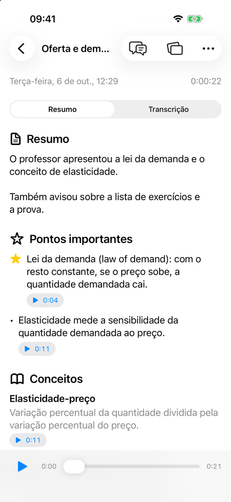
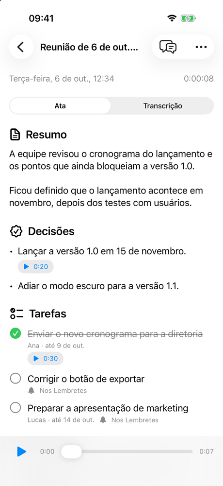
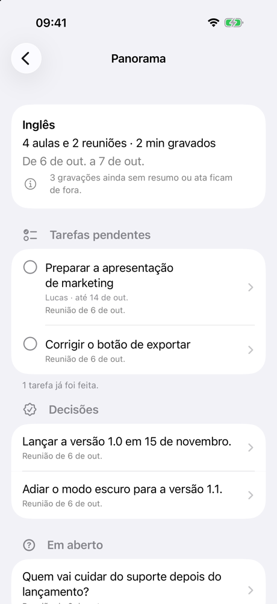
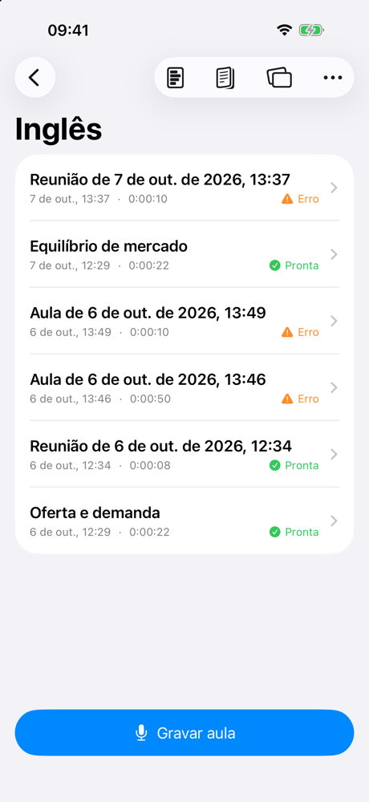

# Anota

**Record a class or a meeting on your iPhone. Get study notes or meeting minutes. Pay cents, not a subscription.**

Anota is a personal iOS app that records lectures and in-person meetings, transcribes them **on the device**, and turns the transcript into something useful with the AI provider of your choice (Claude, OpenAI or Gemini):

- a **class** becomes a study summary with key points, concepts, exam notices and review questions;
- a **meeting** becomes minutes with decisions, action items (owner and due date), open questions and subjects discussed.

No account, no server, no bot joining your call. Audio and transcripts never leave the phone. Only the transcript text is sent to the AI, and only when you tap a button.

<p align="center">
  
  
  
  
</p>

> The interface is in Brazilian Portuguese. Recordings can be in Portuguese or English, and the summary language is chosen separately.

## Features

### Recording
- **One tap to record**, from the app, Siri ("Gravar no Anota"), the Action button, or the Control Center / Lock Screen control.
- **Live Activity** on the Lock Screen and Dynamic Island while recording.
- **Mark important moments** ("Importante") while recording. The AI makes sure those parts show up in the summary, flagged with ⭐.
- **Long recordings are safe.** Audio is written as ADTS AAC, so a recording survives the app being killed, and the app turns any interrupted recording into a lecture at the next launch.

### Classes
- **Study summary** with key points, concepts, exam and homework notices, and review questions with answers.
- **Every item links to the recording.** Tap ▶ 0:42 to hear the professor explain it, or tap any phrase of the transcript.
- **Ask about the class**: a chat that answers from the transcript and points to the exact moment.
- **Flashcards** for one class or a whole course.
- **Exam guide** for a course, built from all its class summaries: what you must know, topics, concepts, deadlines and practice questions.
- **Class schedule**: set when a course meets, and recordings started during class are filed into its folder automatically.

### Meetings
- **Minutes** with summary, decisions, action items, open questions and subjects discussed.
- **Action items** can be ticked off, and sent to the **Reminders** app with their owner and due date. Deadlines like "by Friday" are resolved from the meeting date.

### Organizing
- **Folders and subfolders** (for example *University › Calculus › Exam 1*). Each folder sets the kind of recording (class or meeting) and the spoken language, or inherits them from its parent.
- **Folder overview**: every pending task, decision, open question, exam date and marked moment across a folder and its subfolders, plus a timeline. It's computed on the device, so it's free and always current.
- **Search** across titles, summaries and transcripts.
- **Export** summaries, minutes and guides as Markdown or PDF.

## How it works

```
Record (AAC 16 kHz mono)
   │
   ▼
Transcribe on device ── Apple SpeechAnalyzer / SpeechTranscriber (iOS 26), free and offline
   │
   ▼  only when you tap "Gerar resumo" / "Gerar ata"
Summarize ───────────── Claude · OpenAI · Gemini, structured JSON output
   │
   ▼
SwiftData on the device: summary, timestamped transcript, chat, guides
```

- **Bring your own key.** Each provider's API key is stored in the iOS **Keychain** and sent only to that provider.
- **Structured output.** Every AI call asks for a strict JSON schema, so summaries render as real UI (checkboxes, play buttons, sections) instead of a wall of text.
- **Timestamps.** The transcript is sent in ~30 s blocks tagged like `[754s]`, and the AI returns `startSeconds` for each item, which is what makes "play from here" work.
- **Background work.** Transcribing and summarizing keep running after you leave the app, using iOS 26 continued processing tasks.
- **Cheap.** Estimated cost per 1h30 recording at list prices: from under US$ 0.01 (GPT-6 Luna, Gemini Flash-Lite) to about US$ 0.18 (Claude Opus 5.5). You pick the model in Settings.

## Requirements

- iPhone with **iOS 26** or later. On-device transcription doesn't run in the Simulator.
- **Xcode 26** or later to build.
- An API key from at least one provider:
  - [Anthropic (Claude)](https://platform.claude.com/settings/keys)
  - [OpenAI](https://platform.openai.com/api-keys)
  - [Google AI Studio (Gemini)](https://aistudio.google.com/apikey)

## Getting started

1. Clone the repository and open `NoteTaker.xcodeproj`.
2. In **Signing & Capabilities**, choose your own team for the `NoteTaker` and `NoteTakerWidgets` targets. You may need to change the bundle identifier.
3. Run on your iPhone.
4. In the app, open **Ajustes** (Settings), choose a provider and model, and paste your API key.
5. Record something, wait for the transcription, then tap **Gerar resumo** or **Gerar ata**.

Or build from the command line:

```bash
xcodebuild -project NoteTaker.xcodeproj -scheme NoteTaker -destination 'generic/platform=iOS' build
```

## Project layout

| Path | What's there |
| --- | --- |
| `NoteTaker/Models` | SwiftData models (`Lecture`, `Folder`) and the AI output types (`LectureSummary`, `MeetingSummary`, `StudyGuide`) |
| `NoteTaker/Services` | Recording, transcription, the AI clients (`ClaudeClient`, `OpenAIClient`, `GeminiClient`), prompts and export |
| `NoteTaker/Views` | SwiftUI screens |
| `Shared` | App Intents and Live Activity attributes, shared by the app and the widget extension |
| `Widgets` | Live Activity and Control Center control |
| `scripts/generate_icon.swift` | Draws the app icon in code |

[`CLAUDE.md`](CLAUDE.md) has a deeper tour of the architecture.

## Limitations

- **Speakers aren't identified.** The on-device transcriber doesn't separate voices, so the AI only attributes a task to someone when the conversation makes it clear ("João, can you take this?").
- **In-person audio only.** iOS doesn't let an app record another app's audio, so Zoom or Meet calls are only captured through the iPhone's microphone.
- **Portuguese and English** are the supported recording languages, and the interface is in Portuguese only.

## Privacy

Everything is stored on your iPhone: audio files, transcripts, summaries and API keys (in the Keychain). There's no backend and no analytics. The only network traffic is the request to the AI provider you chose, made when you ask for a summary, minutes, a guide or a chat answer.
